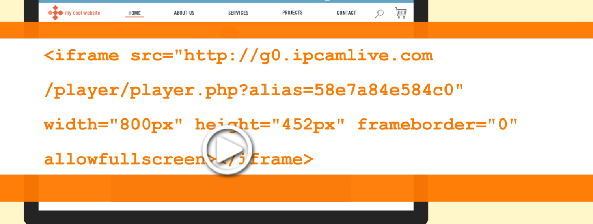

# 提示词

1. 设计index.html

   基于现在的已有界面，实现`
 `等按钮的html页面的实际跳转功能，这些页面的html文件都在同一文件夹下。

   例如

2. 设计long-recording.html界面

   1. 需要修改画质需求 分为1080P和2k ，网页端的显示窗口可以适当放大

   2. 可以添加呼吸灯或其他效果 来实现提示用户录制在进行中的效果

   3. 在页面上加入计时器，提示用户已经录制的时长

   4. start stop exit 的逻辑可以适当参考ui.py :

      但是稍微修改 ：

      ​	start表示开始录制，加入计时器开始计时，呼吸灯一直闪烁

      ​	stop点击表示暂时停止录制，计时器暂停，呼吸灯变颜色，不闪烁 stop按键上的文字变		为continue， 用户点击后continue继续录制

      ​	exit不变，只是退出程序，即关闭网页

      ​	添加finish按钮，点击后可以提前结束录制

3. 设计后端逻辑 保证视频文件可以使用openCV操作，并写入数据库 可以参考我提供的ui.py里的逻辑

以上文件都分开进行输出，尽量一次性交付可使用的文件

✅设计setting.db数据库：

用于存储多个摄像头的信息，我认为包括 摄像头编号（主键） 摄像头对应的rstp地址 所选的视频通道 channel

# 周末工作

1. （✅初步）4个按钮的功能

2. ✅先写settings的request，提出来存数据库

3. **把视频在页面显示的原理搞清楚，然后封装成函数，把rstp接口留出来从数据库里面提取**

4. 长视频应该有三个视频框进行操作，看能不能位置对应好

   1. long recording页面应该从上到下显示多个
   2. 在server.py中将global_config的每个rstp直接放到调用generate_frames 的参数里
   3. 每个摄像头的这4个start等按钮可以同时操作 但是保存时，文件名要有前缀carema${i}

# 看出来的新问题 3月1日晚

1. 前后端的计时器时间不一样 前端显示可以通过怎样的操作和后端同步呢
2. ✅在long recording上面添加一组呼吸灯提示 作为正在录制的提示 点击stop后停止呼吸 变为黄色
   1. 检查一下第1个device connected的按钮功能，只要连接上了rstp对应的摄像头，它就可以变绿。一直闪烁，如果要是没有连接上之前一直保持为红色。
   2. 第2个on recording的按钮当我并没有按下start按钮时，一直保持为红色。然后当我按下start按钮时开始变绿，然后闪烁当按下stop按钮时，呼吸灯变为黄色暂停闪烁，当我系修一下continue and you是呼吸灯，变回绿色继续闪烁。
3. ✅exit没法直接关闭页面 逻辑可以设置为跳回index
  

# 3月2日

1. 三个视频无法同时显示 看能不能采用线程进行展示
2. 视频无法保存到本地到底是什么原因
3. ipcamlive 

# 3月3日

现在的start和finish按钮，在进行操作时有些卡顿，我希望能控制三组视频的同时录制和暂停、继续与结束，

start表示开始录制，并开始录制文件进入本地，

​	stop点击表示暂时停止录制，计时器暂停，呼吸灯变颜色，不闪烁 stop按键上的文字变		为continue， 用户点击后continue继续录制

添加finish按钮，点击后可以结束录制，将视频文件保存到videos文件夹，并在videos.db中加入记录

可以吗，怎么操作 

